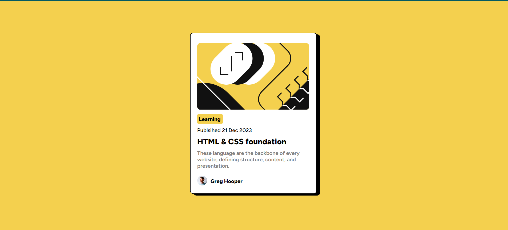

# Frontend Mentor - Blog preview card solution

This is a solution to the [Blog preview card challenge on Frontend Mentor](https://www.frontendmentor.io/challenges/blog-preview-card-ckPaj01IcS). Frontend Mentor challenges help you improve your coding skills by building realistic projects. 

## Table of contents

- [Overview](#overview)
  - [The challenge](#the-challenge)
  - [Screenshot](#screenshot)
- [My process](#my-process)
  - [Built with](#built-with)
  - [What I learned](#what-i-learned)
  - [Continued development](#continued-development)
- [Author](#author)

https://darship19.github.io/Blog-preview-card/
## Overview

### The challenge

Users should be able to:

- See hover and focus states for all interactive elements on the page

### Screenshot

![]

## My process

### Built with

- Semantic HTML5 markup
- CSS custom properties
- Flexbox
- CSS Grid

### What I learned

I learn how to center an element horizontally, style in both desktop and mobile formats, and use pseudo:active elements in CSS.

### Continued development

Make use of your knowledge I will complete this project. I'll be working on more projects in the future. and I'm going to work on additional front-end projects.

### Useful resources

- [w3 school](https://www.w3schools.com/)

## Author

- Frontend Mentor - [@darship19](https://www.frontendmentor.io/profile/darship19)

